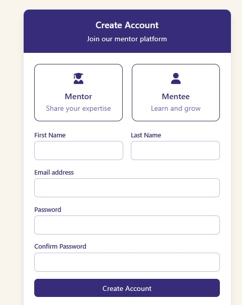
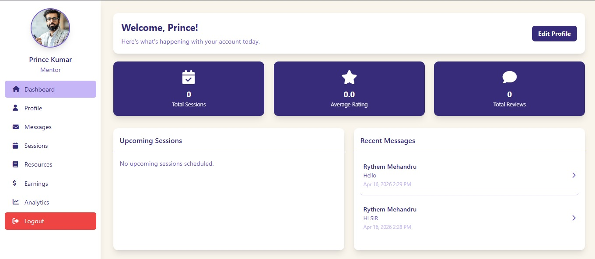
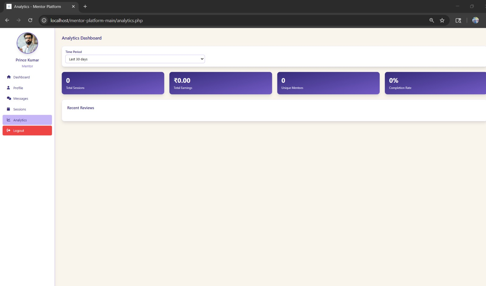
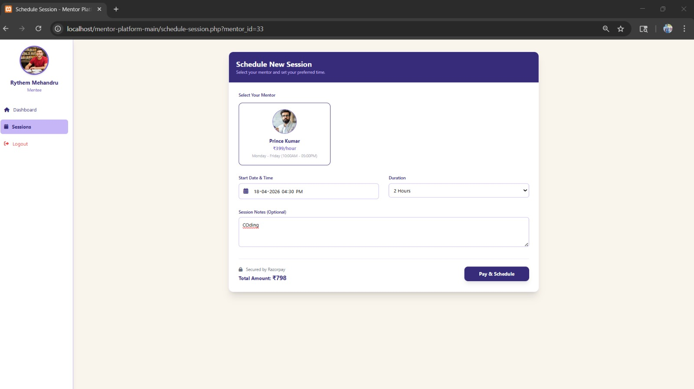

# Mentor Platform

## Overview

Mentor Platform is a web-based mentoring application designed to help mentees connect with mentors and receive guidance for doubts related to computer languages and learning topics.

The platform creates a structured learning environment where mentees can discover mentors, schedule sessions, communicate directly, access resources, and track their progress while administrators manage overall platform activities.

---

## Objective

The objective of this project is to simplify mentor–mentee interaction and provide a centralized platform for learning support, communication, and progress monitoring.

---

## Features

### Authentication & Access
- Secure user login and registration
- Role-based access control

### Dashboard
- Personalized dashboard experience

### Mentor Discovery
- Search and connect with suitable mentors

### Session Management
- Schedule and manage mentoring sessions

### Communication
- Messaging between mentors and mentees
- Notification support

### Progress Tracking
- Monitor learning progress and activity

### Analytics
- Visual insights using Charts.js

---

## Technologies Used

### Frontend
- HTML
- CSS
- JavaScript
- Charts.js

### Backend
- PHP

### Database
- MySQL

---

## User Roles

### Super Admin
- Manage mentors and mentees
- View user details
- Approve or reject registrations

### Mentees
- Access dashboard
- Connect with mentors
- Track progress
- Send messages
- Schedule mentoring sessions
- Submit mentor reviews

### Mentors
- Share learning resources
- Set hourly mentoring rates
- Track earnings
- View completed sessions

---

## System Workflow

1. User registers or logs into the platform  
2. Dashboard loads personalized information  
3. Mentees search and connect with mentors  
4. Sessions are scheduled and managed  
5. Messages and notifications support communication  
6. Admin monitors and manages platform operations  

---

## Project Structure

```text
mentor-platform/
│
├── assets/
├── uploads/
│
├── index.php
├── login.php
├── register.php
├── logout.php
├── dashboard.php
├── profile.php
│
├── find-mentor.php
├── schedule-session.php
├── session-details.php
├── sessions.php
├── review-session.php
│
├── mentee-resources.php
├── resources.php
├── goals.php
├── analytics.php
├── earnings.php
│
├── messages.php
├── view_messages.php
├── notifications.php
│
├── contact.php
├── about.php
│
├── super-admin.php
│
├── config.php
│
├── mentor_platform.sql
├── notifications.sql
│
├── README.md
```

---

## Module Overview

### Authentication
- Registration
- Login
- Logout
- Profile Management

### Mentor Interaction
- Mentor Search
- Session Scheduling
- Session Details
- Session Reviews

### Learning Support
- Resources
- Goal Tracking
- Dashboard Access

### Administration
- Super Admin Panel
- Analytics
- Notifications

### Database
- MySQL Integration
- SQL Configuration Files

---

## Key Highlights

- Full-stack web application
- Multiple user roles
- Session scheduling system
- Messaging functionality
- Analytics integration
- Database-driven architecture

---

## Learning Outcomes

Through this project, I improved my understanding of:

- Full-stack web development
- Database management
- User authentication
- Frontend and backend integration
- System design and workflow management
- Analytics and data visualization

---

## Future Improvements

- Mobile responsiveness
- Live video mentoring
- Assignments and assessment system
- Session recommendation system
- Enhanced analytics dashboard

---

## Screenshots




.jpeg)







## Author

Developed as a Final Year BCA Project.
